# CLI Expenses

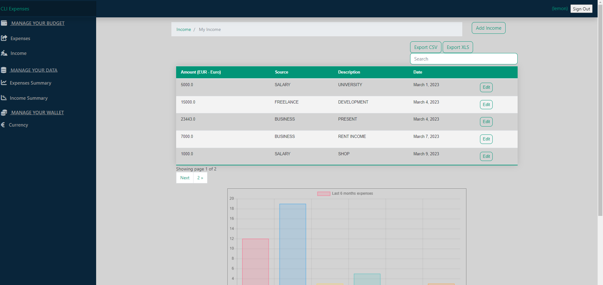

Managing expenses and incomes can be a daunting task, especially when it comes to keeping track of all the details and making sure everything is in order. However, it is an essential part of maintaining financial stability and achieving your financial goals.

Visit the deployed website [here](https://trulyexpenses.herokuapp.com/).

## Table of Contents

1. [User Experience (UX)](#user-experience-ux)
    1. [Strategy](#strategy)
        1. [Project Goals](#project-goals)
        2. [User Goals](#user-goals)
        3. [Strategy Table](#strategy-table)
    2. [Scope](#scope)
        1. [User Stories](#user-stories)
    3. [Structure](#structure)
    4. [Skeleton](#skeleton)
    5. [Surface](#surface)
2. [Features](#features)
    1. [General](#general)
    2. [Home Page](#home-page)
    3. [About Page](#about-page)
    4. [Search Results Page](#search-results-page)
    5. [Question Detail Page](#question-detail-page)
    6. [Ask Question Page](#ask-question-page)
    7. [Leave Reply Page](#leave-reply-page)
    8. [Edit Question Page](#edit-question-page)
    9. [Delete Question Page](#delete-question-page)
    10. [Edit Reply Page](#edit-reply-page)
    11. [Delete Reply Page](#delete-reply-page)
    12. [Authentication Pages](#authentication-pages)
3. [Technologies Used](#technologies-used)
    1. [Languages Used](#languages-used)
    2. [Libraries and Frameworks](#languages-and-frameworks)
    3. [Packages / Dependecies Installed](#packages--dependecies-installed)
    4. [Database Management](#database-management)
    5. [Tools and Programs](#tools-and-programs)
4. [Testing](#testing)
    1. [Go to TESTING.md](https://github.com/josswe26/code-buddy/blob/main/TESTING.md#code-buddy-testing)
5. [Deployment](#deployment)
6. [Finished Product](#finished-product)
7. [Credits](#credits)
8. [Known Bugs](#known-bugs)
9. [Acknowledgements](#acknowledgements)

***

## User Experience (UX)

### Strategy

#### Project Goals

* The website contains simple colors for adminstative purposes.

* Responsive design to make the website accessible on different screen sizes.

* Structure is easy to understand and navigates effortlessly.

* Site users are able to register an account in order to interact with the content.

* Site users are able to create expenses and incomes, delete them, edit them.

#### User Goals

* As a Site Admin, I want to manage the site content.

* As a Site User, I want to be able to interact with the content.

* As a Site User, I want the information to be easy to find and read.

* As a Site User, I can create new expenses and incomes.

* As a Site User, I want to manage the content I created.

* As a Site User, I want to be able to help make the content more relevant.

### Scope

The first phase will include the features that have been identified in order to build the minimum viable product.

### Mockflow

At the start I created a website template  for understanding what should be going on.

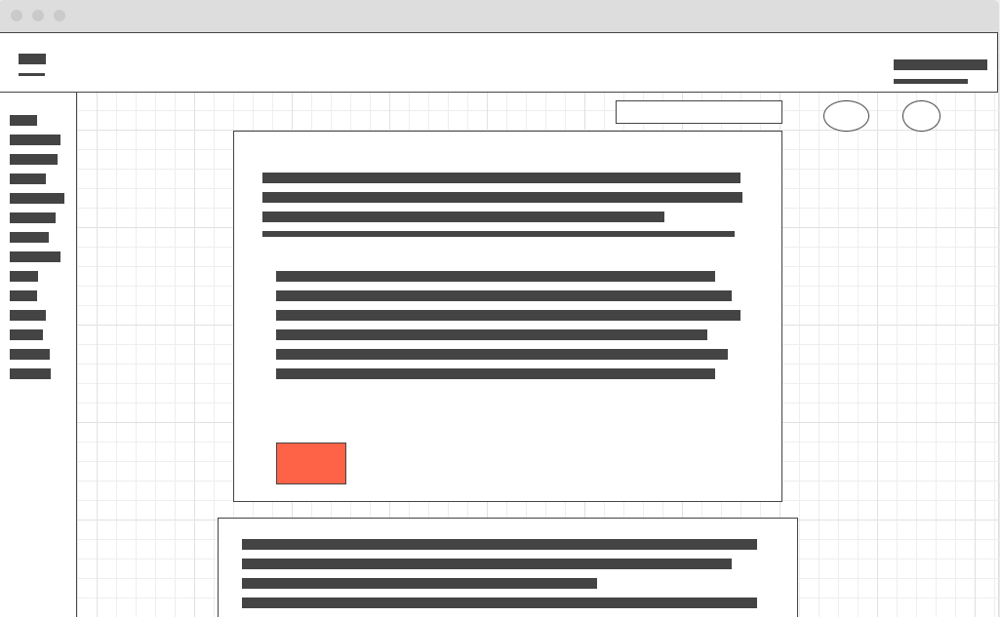

* Header, navigation bar are consistent through all pages.

* Links and forms provide clear feedback to the site user.

* The opportunity to add additional content to the website is provided for the site user once they register an account.

### Skeleton

#### Lets Hang Around The Webiste

### Register

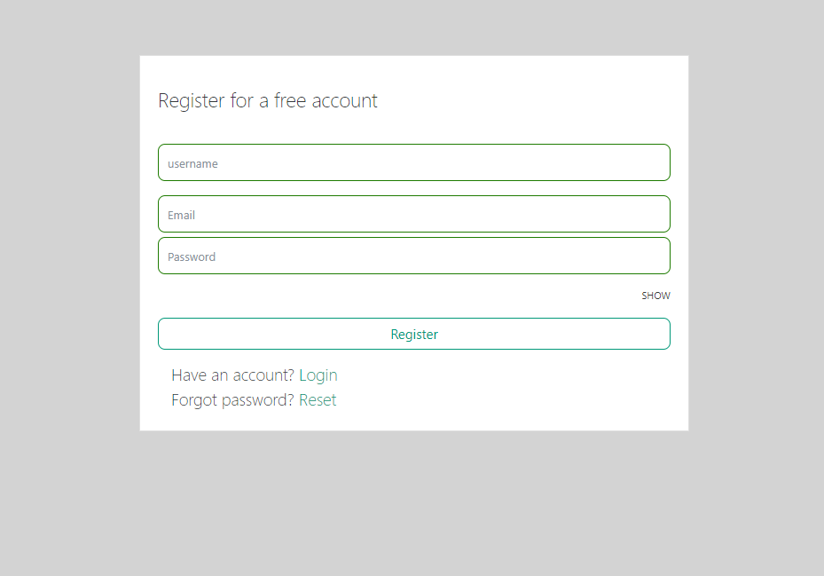

Why is it important to have login area?
Logging in to a website is important for several reasons:

Personalization: When you log in, the website can personalize the experience for you. It can remember your preferences, display content relevant to your interests, and provide a customized user interface.

Security: Logging in provides an additional layer of security for both you and the website. By requiring a username and password, the website can ensure that only authorized users have access to sensitive information or functions.

Access to restricted content or features: Some websites offer premium content or features that are only available to registered users. By logging in, you can gain access to these exclusive features.

Tracking and analytics: When you log in, the website can track your activity and behavior on the site. This information can be used to improve the user experience, analyze user behavior, and make data-driven decisions.

Overall, logging in to a website can enhance your experience, provide additional security, and unlock access to exclusive content or features.

### Login

After successfull registration, user will receive an confirmation email, to follow the instuctions.

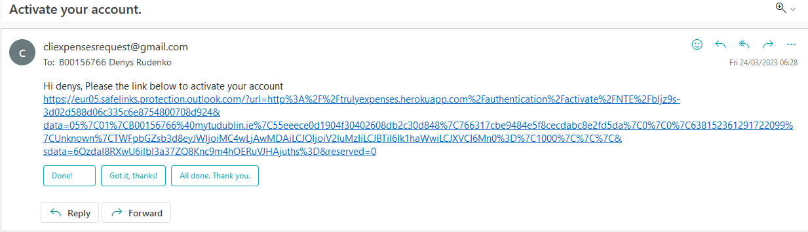

In a good programming practice user should login to tour website onl after confirmation email accepted.It`s really import to pay attention to make login and registration securely.

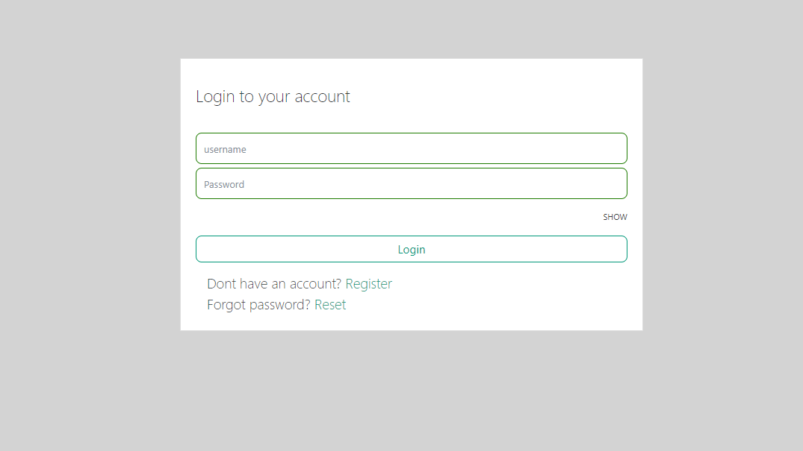

### Main page

After succesfull login user can interact with a website. He can create expenses, income , edit them, delete them, and count how much he spend by the group and categories with additional information. It`s really important to keep on track on counting you budget.

### Download your expenses

On CLI Expenses you are able to download your own records, see in the picture below.

[Back to top ⇧](#code-buddy)

### Expenses and Incomes

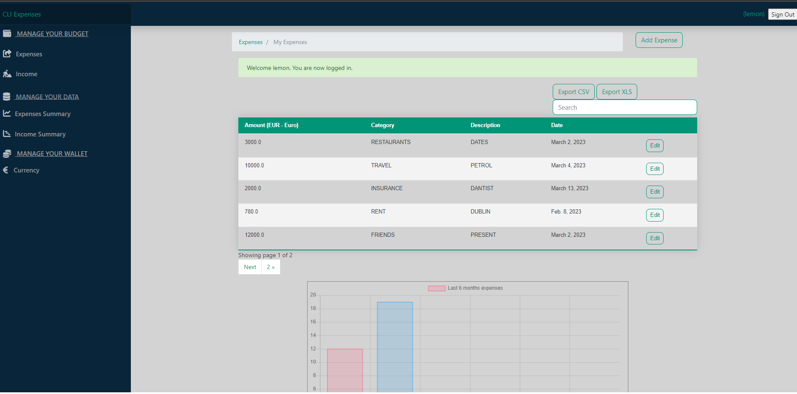

You could create how much you need, if you dont have space you can press arrow tag to link for you your old expenses.

### Format of expenses and incomes on your pc

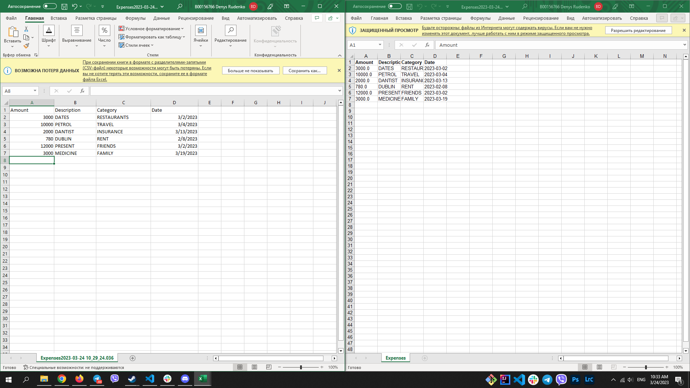

As you see, pehaos its not in a good format but, you could see your table clean as you need.

### Search bar

I deployedspecial are where you can find your incomes or expenses much more easier by targeting it by speacial value.

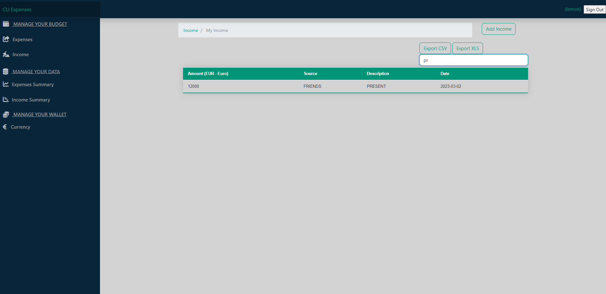

### Currency

In additional section you could pick any currency you would like.

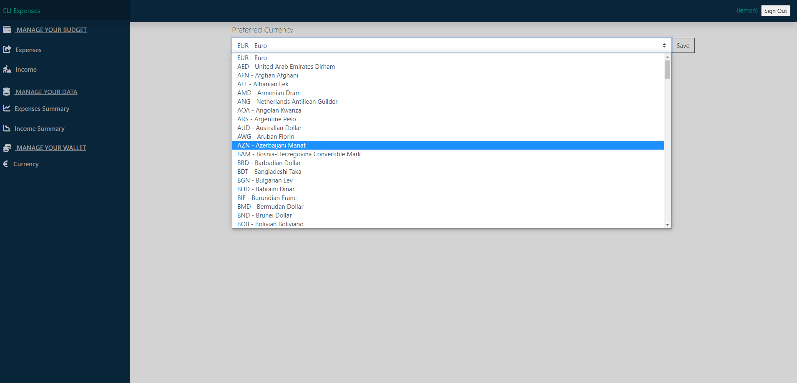
### Model Graph

A model graph, also known as a computational graph, is a way of representing a mathematical model or algorithm as a directed graph, where nodes represent mathematical operations and edges represent the flow of data between those operations. Model graphs are commonly used in machine learning to represent neural networks and other types of models.

Model graphs can be helpful in a number of ways:

Visualization: Model graphs provide a visual representation of the model or algorithm, which can help researchers and engineers better understand how the model works and identify areas for improvement.

Debugging: When a model is not performing as expected, a model graph can help pinpoint where errors are occurring by tracing the flow of data through the graph.

Optimization: By analyzing a model graph, researchers can identify parts of the model that are computationally expensive and optimize those parts to improve performance.

Deployment: Model graphs can be used to deploy models to production systems, such as mobile devices or cloud servers, by converting the graph to a format that can be executed efficiently on those systems.

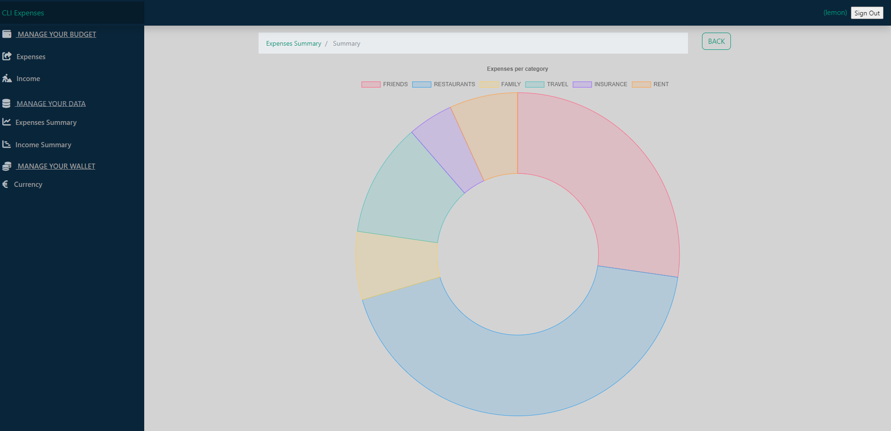

### Create Expanses

In this section you could create expanse or income and make a description about it.

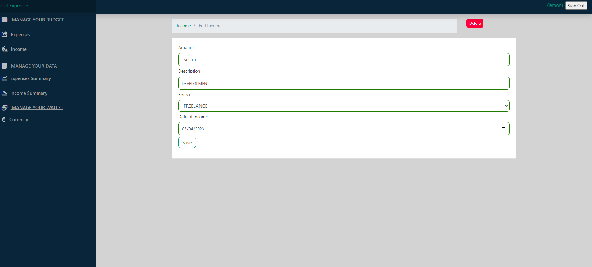

### Lighthouse
As I was really really late with a submission my statistics isnt that good how it suppost to be.

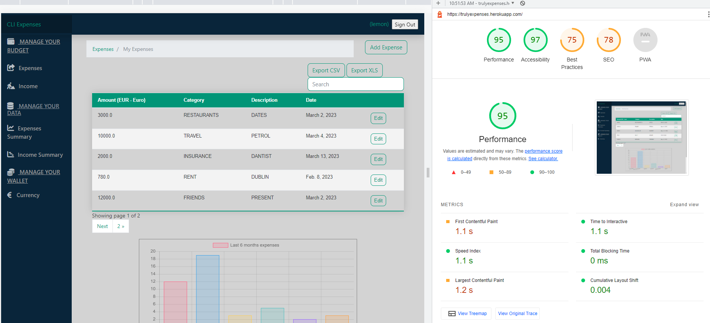

### CSS

Mostly I used bootstrap, so in css valiadation I got a lot of errors and can do nothing with that. I suppose I have a small experience it it.

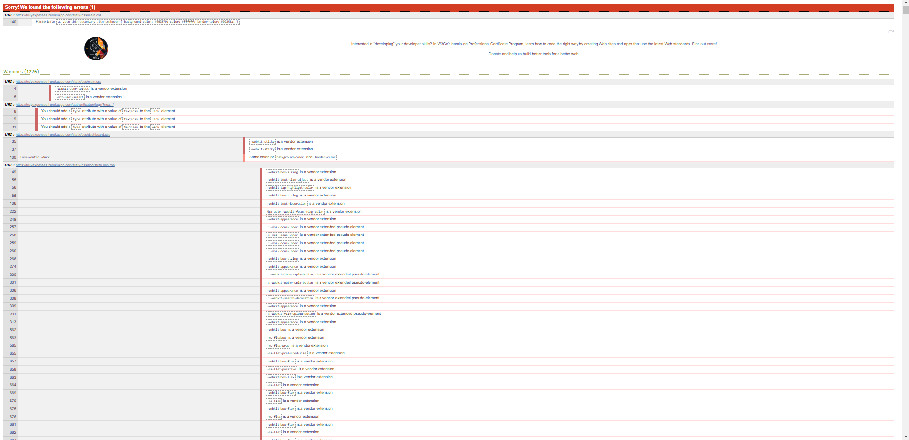

### Admin User

I decided to style admin panel and some random colours from internet. Alse I asked my friends to login to my website to test it out and tell me the bugs or dislikes aobut this website.

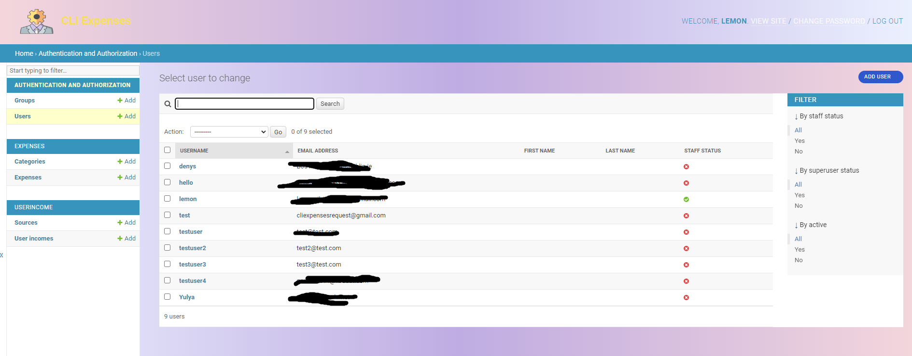

### Search bar

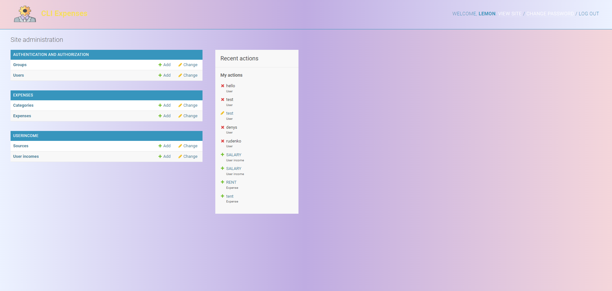

### Search bar

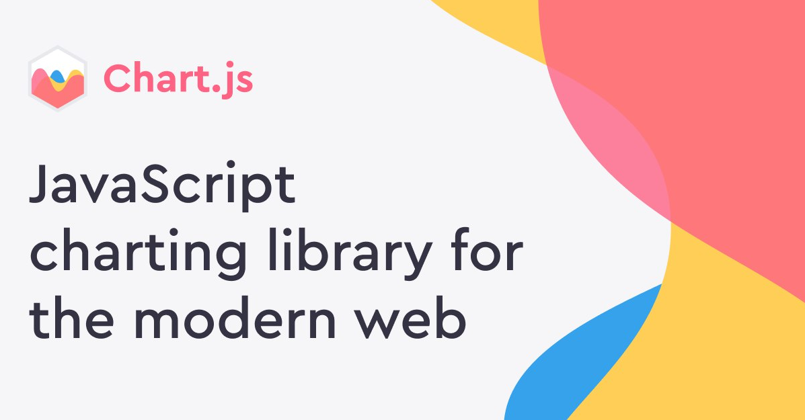

### Search bar

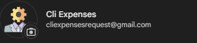

### Search bar

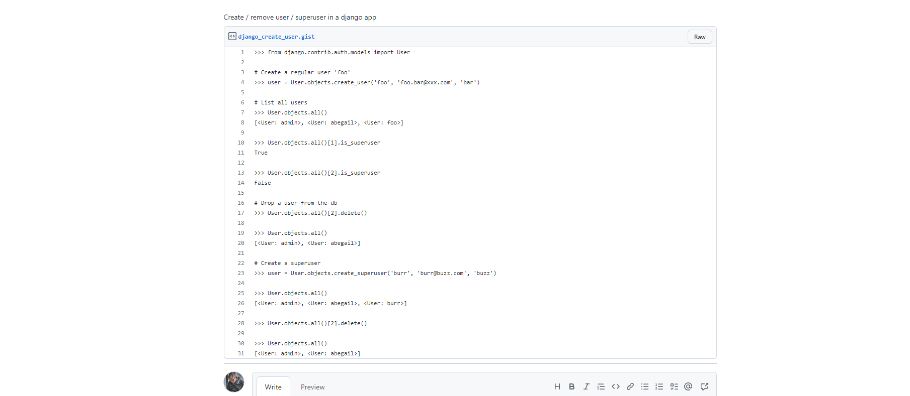

