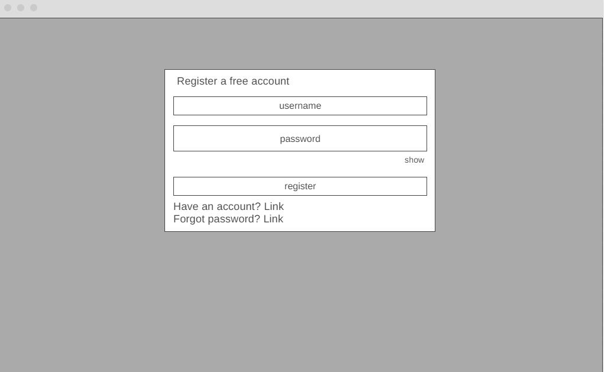
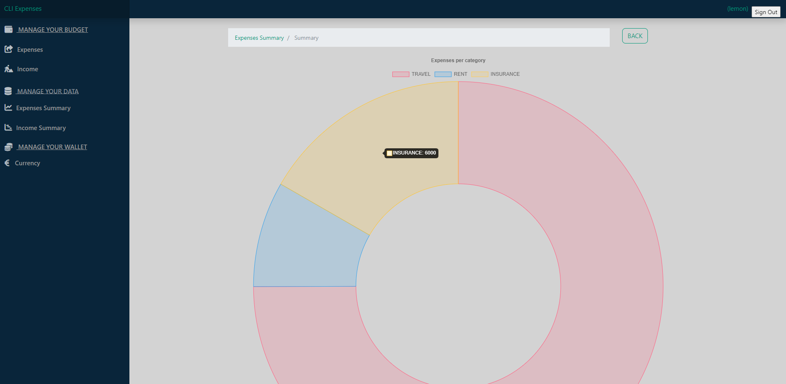

# CLI Expenses


Managing expenses and incomes can be a daunting task, especially when it comes to keeping track of all the details and making sure everything is in order. However, it is an essential part of maintaining financial stability and achieving your financial goals.

Visit the deployed website [here](https://trulyexpenses.herokuapp.com/).

## ATTENTION!

Make sure you follow steps bellow to log in on the website:

    * Register via application form, choose the username and password.
    * You will receive a confirmation email, follow the steps in email provided.
    * After successfully you confirm, use your username and password to log in.


## Table of Contents

1. [User Experience (UX)](#user-experience-ux)
    1. [Strategy](#strategy)
        1. [Project Goals](#project-goals)
        2. [User Goals](#user-goals)
        3. [Strategy Table](#strategy-table)
    2. [Scope](#scope)
        1. [User Stories](#user-stories)
    3. [Folder Structure](#folder-structure)
    4. [Skeleton](#skeleton)
    5. [Surface](#surface)
2. [Features](#features)
    1. [General](#general)
    2. [Home Page](#home-page)
    3. [Chart Page](#chart-page)
    4. [Search Results Page](#search-results-page)
    5. [Edit Expanse/Income Page](#edit-expenseincome-page)
    6. [Add Expanse/Income Page](#add-expanseincome-page)
    7. [Currency Page](#currency-page)
    8. [Admin Page](#admin-page)
    9. [Authentication Pages](#authentication-pages)
3. [Technologies Used](#technologies-used)
    1. [Languages Used](#languages-used)
    2. [Libraries and Frameworks](#languages-and-frameworks)
    3. [Packages / Dependecies Installed](#packages--dependecies-installed)
    4. [Database Management](#database-management)
    5. [Tools and Programs](#tools-and-programs)
4. [Testing](#testing)
    1. [Go to TESTING.md](https://github.com/josswe26/code-buddy/blob/main/TESTING.md#code-buddy-testing)
5. [Deployment](#deployment)
6. [Finished Product](#finished-product)
7. [Credits](#credits)
8. [Known Bugs](#known-bugs)
9. [Acknowledgements](#acknowledgements)


***


## User Experience (UX)

### Strategy

#### Project Goals

* The website contains simple colors for a modern design and also to not draw attention from the content.

* Responsive design to make the website accessible on different screen sizes.

* Structure is easy to understand and navigates effortlessly.

* Site users are able to register an account in order to interact with the content.

* Site users are able to create, delele, edit expenses and incomes.

* Site users suppose to confirm the account before, to log in.


#### User Goals

* As a Site Admin, I want to manage the site content.

* As a Site User, I want to be able to interact with the content.

* As a Site User, I want the information to be easy to find and read.

* As a Site User, I can create new expenses and incomes.

* As a Site User, I want to manage the content I created.

* As a Site User, I want to be able to help make the content more relevant.


#### Strategy Table

Opportunity / Problem | Importance | Viability / Feasibility
--- | --- | ---
Responsive design | 5 | 5
Account registration | 5 | 5
Ability to reset password | 3 | 2
Ability to create account | 3 | 2
Create, edit and delete expenses | 5 | 4
Create, edit and delete incomes | 5 | 4
Ability to search for expenses and incomes | 4 | 3
Add category for expenses and incomes | 3 | 1
Add description for expenses and incomes | 4 | 3
**Total** | **37** | **29**


### Scope

According to the strategy table, not all features can be implemented in the first release of the project. For this reason, the project will be divided in multiple phases. The first phase will include the features that have been identified in order to build the minimum viable product.

**First Phase**

* Responsive design

* Account registration

* Reset password

* Account confirmation

* Expenses dashboard

* Income dashboard

**Second Phase**

* Ability to edit and delele expenses, incomes

* Chart for expenses and incomes

* Add categories and description for expenses and incomes


#### User Stories

GitHub projects was used as my project management tool to track user stories. Using a Kanban board helped to focus on specific tasks and track the project progress.

**Project CLI Expanses**


**Project CLI Expanses at the end**


### Folder Structure

A clear and organized folder structure makes it easy for developers to find and understand where certain files are located within a project. It also helps to avoid clutter and confusion, making the project easier to navigate and work with. Contents: authentication, django_todo, expenses, templates, userincome, userpreferences.


* Authentication contain whole python files that resposible for login, reseting password, saving the user id`s.

* Django_todo is Python django manual folder that responsible for paths and most functionality of whole files.

* Expenses responsible for functionality for expenses dashboard, delete, edit, adding expenses.

* Templates responsible for JavaScript functionality and contain html files, css files, images.

* Userincome responsible for functionality for incomes dashboard, delete, edit, adding incomes.

* Userpreferences responsible for functionality of currency page that represent the current value for incomes and expenses.


### Skeleton

#### Wireframes

[Wireframe](https://wireframe.cc/) has been used to showcase the appearance of the site and display the placement of the different elements whitin the pages.

Page | Desktop Version | Mobile Version
--- | --- | ---
Expenses / Incomes |  | 
Expenses / Income Sum |  | 
Edit expense/income |  | 
Currency |  | 
Login |  | 
Register |  | 
Reset |  | 


### Surface

#### Color Scheme


The colors used in the website are dark blue, turquoise and light green. (#019577, #09253a, #d9f0d1) For buttons I used light green color, dark blue for the header and left panel and turquoise for the text hover.

Also I used (#d3d3d3) light grey color for the body.

The colors are were chosen keeping in mind simplicity but also providing the website a modern design. This in order to keep the focus on the content but also appealing for the users.


#### Typography

The Fonts being used in the site is sans-serif and monospace for whole text and for the main menu navigation bar.

```css
--font-family-sans-serif: "Segoe UI", "Source Sans Pro", Calibri, Candara,
    Arial, sans-serif;
--font-family-monospace: SFMono-Regular, Menlo, Monaco, Consolas,
    "Liberation Mono", "Courier New", monospace;
```

[Back to top ⇧](#code-buddy)


## Features

### General

* The website has been designed from a dekstop first perpective.

* Responsive design across all device sizes.

* Navigation Bar


    *  Contains the main name and section links.

    * The navigation bar contains links to all sections to facilitate navigation across the site. It also has a hover effect that changes color to provide feedback to the Site User for a better user experience. Also icons for each section displayed. The navigation bar on the left side of the screen.

* Search bar and Export buttons.


    * Provide the Site User an input field and import your expenses/incomes in csv or exel.


     *  As we can mention in the image there is an example of incomes that I created on the website imported to exel.

* Add expenses/incomes
  
  

    * The button for adding expenses or incomes in the right corner.


### Home Page

* Expanses/Incomes list


    * Display a list of expenses/incomes that have been created.

    * User can edit the expense by pressing the button in right corner in front of expense.

    * Expenses/Incomes are sorted by the date.

    * Expenses/Incomes have been created as table in html with headings such as : amount, category, date, description.

    * Also there is additional button at the end that helps the user to go on the next page.


    * At the buttom of the page there is a chart displayed to show the user details about his incomes/expenses with the amount for each category.


    * In the right corner at the top, we have a button to log out with a username.


### Chart Page

* Provide relevant information about the website's objective.



* Extra button that will allow to come back to your expenses/incomes dashboard.


### Search Results Page


* Display information about the Search being handled

* Display a paginated list of the expenses/incomes matching the search and its relevant information for the user to identify.


### Edit Expense/Income Page


* Display the full information about expense or income, such as description, amount, date, category.

* Additional button to delete expense or income.

* Save button included.


### Add Expanse/Income Page


* Provide a form to allow registered Site Users to create a new expense/income.

* There is few category list such as: travel, insurance, restaurant, family, rent, present, friends.

### Currency Page


* Provide a form to allow choose the currency wallet for your incomes/expenses.


### Admin Page


* Provide an admin access for the website where admin can do everything with users, expenses, incomes, groups.


### Authentication Pages

Page | Purpose | Image |
--- | --- | --- |
Register | Allow the Site User to sign up an account for the website. |  |
Login | Allow the Site User to sign in with their account. |  |
Logout | Allow the Site User to sign out from their account. |  |


[Back to top ⇧](#cli-expenses)


## Technologies Used

### Languages Used

* [HTML5](https://en.wikipedia.org/wiki/HTML)
* [CSS3](https://en.wikipedia.org/wiki/CSS)
* [JavaScript](https://en.wikipedia.org/wiki/JavaScript)
* [Python](https://en.wikipedia.org/wiki/Python_(programming_language))


### Libraries and Frameworks

* [Django](https://www.djangoproject.com/)   
    * Django was used as web framework.
   
* [Bootstrap 5](https://getbootstrap.com/docs/5.0/getting-started/introduction/)  
    * Bootstrap 5 was used throughout the website to help with styling and responsiveness.

* [Google Fonts](https://fonts.google.com)  
    * Google fonts was used to import the fonts into the html file, and were used on all parts of the site.

* [Font Awesome](https://fontawesome.com)  
    * Font Awesome was used throughout the website to add icons for aesthetic and UX purposes. 

* [jQuery 3.6.0](https://jquery.com/)  
    * jQuery was used as a JavaScript library to help writing less JavaScript code.  


### Packages / Dependecies Installed


* [Cloudinary](https://cloudinary.com/)
    * Cloudinary has been used as image management solution

### Database Management
* [Heroku Postgres](https://www.heroku.com/postgres)   
    * Heroku Postgres database was used in production, as a service based on PostgreSQL provided by Heroku.


### Tools and Programs

* [Git](https://git-scm.com)  
    * Git was used for version control by utilizing the Gitpod terminal to commit to Git and Push to GitHub. 

* [GitPod](https://gitpod.io/)
     * GitPod was used for writing code, committing, and then pushing to GitHub.

* [GitHub](https://github.com)  
   GitHub was used to store the projects code after being pushed from Git. 

* [Heroku](https://www.heroku.com)   
    * Heroku was used to deploy the website.


* [Coolors](https://coolors.co)  
    * Coolors was used to create a color scheme for the website.

* [Wireframe](https://wireframe.cc/)
     * Wireframe was used to create the wireframes during the design phase of the project

* [Chrome DevTools](https://developer.chrome.com/docs/devtools/)
    * Chrome DevTools was used during development process for code review and to test responsiveness.

* [W3C Markup Validator](https://validator.w3.org/)
    * W3C Markup Validator was used to validate the HTML code.

* [W3C CSS Validator](https://jigsaw.w3.org/css-validator/)
    * W3C CSS Validator was used to validate the CSS code.

* [JSHint](https://jshint.com/) 
    * The JSHints JavaScript Code Quality Tool was used to validate the site's JavaScript code.

* [Favicon.cc](https://www.favicon.cc/) 
    * Favicon.cc was used to create the site favicon.

[Back to top ⇧](#cli-expenses)

## Testing

The testing documentation can be found [here](https://github.com/josswe26/code-buddy/blob/main/TESTING.md#code-buddy-testing).


[Back to top ⇧](#cli-expenses)

## Deployment

This project was developed using a [GitPod](https://gitpod.io/) workspace. The code was commited to [Git](https://git-scm.com/) and pushed to [GitHub](https://github.com/") using the terminal.

### Deploying on Heroku
To deploy this page to Heroku from its GitHub repository, the following steps were taken:

1. Create the Heroku App:
    - Select "Create new app" in Heroku.
    - Choose a name for your app and select the location.

2. Attach the Postgres database:
    - In the Resources tab, under add-ons, type in Postgres and select the Heroku Postgres option.

3. Prepare the environment and settings.py file:
    * In the Settings tab, click on Reveal Config Vars and copy the url next to DATABASE_URL.
    * In your GitPod workspace, create an env.py file in the main directory. 
    * Add the DATABASE_URL value and your chosen SECRET_KEY value to the env.py file.
    * Add the SECRET_KEY value to the Config Vars in Heroku.
    * Update the settings.py file to import the env file and add the SECRETKEY and DATABASE_URL file paths.
    * Update the Config Vars with the Cloudinary url, adding into the settings.py file also.
    * In settings.py add the following sections:
        * Cloudinary to the INSTALLED_APPS list
        * STATICFILE_STORAGE
        * STATICFILES_DIRS
        * STATIC_ROOT
        * MEDIA_URL
        * DEFAULT_FILE_STORAGE
        * TEMPLATES_DIR
        * Update DIRS in TEMPLATES with TEMPLATES_DIR
        * Update ALLOWED_HOSTS with ['app_name.heroku.com', 'localhost']

4. Store Static and Media files in Cloudinary and Deploy to Heroku:
    - Create three directories in the main directory; media, storage and templates.
    - Create a file named "Procfile" in the main directory and add the following:
        - web: gunicorn project-name.wsgi
    - Go to Deploy tab on Heroku and connect to the GitHub, then to the required recpository.
    Click on Delpoy Branch and wait for the build to load. When the build is complete, the app can be opened through Heroku.

### Forking the Repository
By forking the GitHub Repository we make a copy of the original repository on our GitHub account to view and/or make changes without affecting the original repository by using the following steps...

1. Log into [GitHub](https://github.com/login) or [create an account](https://github.com/join).
2. Locate the [GitHub Repository](https://github.com/DenysRudenko/Project4-CLI-Expenses).
3. At the top of the repository, on the right side of the page, select "Fork"
4. You should now have a copy of the original repository in your GitHub account.

### Creating a Clone
How to run this project locally:
1. Install the [GitPod Browser](https://www.gitpod.io/docs/browser-extension/ "Link to Gitpod Browser extension download") Extension for Chrome.
2. After installation, restart the browser.
3. Log into [GitHub](https://github.com/login "Link to GitHub login page") or [create an account](https://github.com/join "Link to GitHub create account page").
2. Locate the [GitHub Repository](https://github.com/DenysRudenko/Project4-CLI-Expenses).
5. Click the green "GitPod" button in the top right corner of the repository.
This will trigger a new gitPod workspace to be created from the code in github where you can work locally.

How to run this project within a local IDE, such as VSCode:

1. Log into [GitHub](https://github.com/login) or [create an account](https://github.com/join).
2. Locate the [GitHub Repository](https://github.com/DenysRudenko/Project4-CLI-Expenses).
3. Under the repository name, click "Clone or download".
4. In the Clone with HTTPs section, copy the clone URL for the repository.
5. In your local IDE open the terminal.
6. Change the current working directory to the location where you want the cloned directory to be made.
7. Type 'git clone', and then paste the URL you copied in Step 3.
```
git clone https://github.com/DenysRudenko/Project4-CLI-Expenses
```
8. Press Enter. Your local clone will be created.

Further reading and troubleshooting on cloning a repository from GitHub [here](https://docs.github.com/en/free-pro-team@latest/github/creating-cloning-and-archiving-repositories/cloning-a-repository)


[Back to top ⇧](#cli-expenses)

## Finished Product

Page | Desktop | Mobile |
--- | --- | --- |
| Expenses |  |  |
| Incomes |  |  |
| Expenses Chart |  |  |
| Income Chart | |  |
| Currency | |  |
| Edit expenses/incomes | |  |
| Add expenses/icomes |  |  |
| Sign Up | |  |
| Sign In | |  |
| Sign Out | |  |

[Back to top ⇧](#cli-expenses)

## Credits

### Content

* Website content was written by the developer.
* Example questions and replies were taken from [Stack Overflow](https://stackoverflow.com/)-


### Code

* [Stack Overflow](https://stackoverflow.com/) and [W3Schools](https://www.w3schools.com/) were consulted on a regular basis for inspiration and sometimes to be able to better understand the code being implement.

* Message implementation an dismissal code is taken from [Code Institute](https://codeinstitute.net/)'s django-blog project.

[Back to top ⇧](#cli-expenses)

## Known Bugs

* Upvote/downvote button selection stay the same for all users. This do to an error in the logic. Even though the developer has an idea on how to solve the issue. The solution is yet to be implemented due lack of time.

* The same applies for pagination is Search Results page which is currently not working.

* A known issue with Summernote field validation is present in the project. An invalid form will be posted if the field is empty. A message will however be displayed, informing the user that there has been a problem with the submission.

[Back to top ⇧](#cli-expenses)

## Acknowledgements

* My partner, for her unconditional love, help and continued support in all aspects of life, specially when I did not have time for anything else than to work with this project. You made it possible!

* My friend, Miguel, for being always there to help, no matter what time of the day.

* My tutor, Marcel, for his invaluable support, feedback and guidance through the whole process.

* Code Institute and its amazing Slack community for their support and providing me with the necessary knowledge to complete this project.

[Back to top ⇧](#cli-expenses)