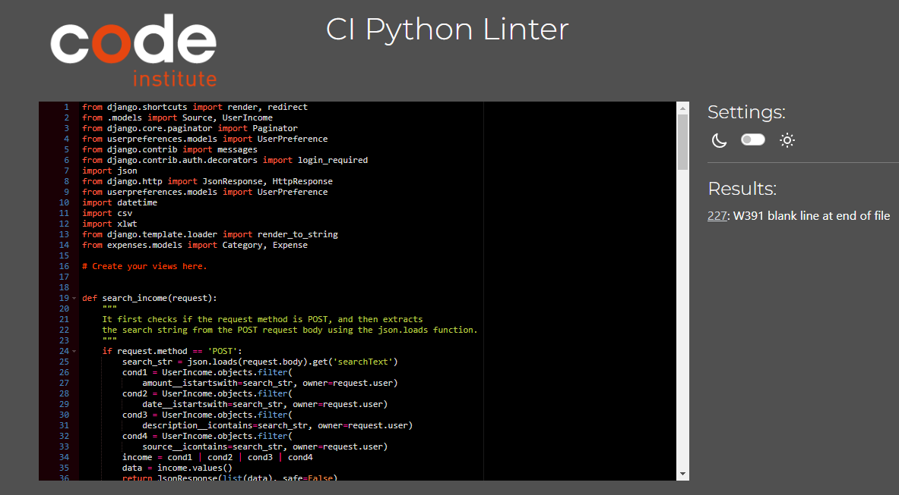

# CLI Expenses Testing

[Back to the README.md file](https://github.com/DenysRudenko/Project4-CLI-Expenses/blob/master/README.md)  

[Back to the Testing section in the README.md file](https://github.com/DenysRudenko/Project4-CLI-Expenses/blob/master/README.md#testing)

[View the live website here](https://trulyexpenses.herokuapp.com/authentication/register)  

## Table of Contents

1. [Testing User Stories](#testing-user-stories)
2. [Code Validation](#code-validation)
3. [Accessibility](#accessibility)
4. [Tools Testing](#tools-testing)
5. [Manual Testing](#manual-testing)


***


## Testing User Stories

### 1. As a Site Admin I can create, read, update and delete expenses and incomes so that I can manage the site content

* An admin site has been provided so that the Site Admin can manage expenses and incomes.

* Expenses and incomes can be created, read, updated and deleted from the site.

* Expenses and incomes main fields are being displayed for the Site Admin to identify them easily.

* Expenses and incomes can be filtered and searched to narrow down a specific group.


### 2. As a Site User I can register an account.

* Account registration has been provided for Site User.

* Account confirmation has be provided for the user.

* Account confirmation email provided for the user.

### 3. As a Site User I can reset password.

* Account reset password provided for the user.

* Account confirmation reset password provided for the user.

* Account confirmation reset password email provided for the user.

### 4. As a Site User I can monitor my expenses/incomes values at chart page.

* A Chart page has been provided for registered Site Users.

* A Chart diagram is available in the Chart page for the Site Users to be able to compare the values by category. 

* Back button displayed at chart page that will help user to redirect to expenses/incomes list.


### 5. As a Site User I can edit and delete my own expenses/icnomes so that I can manage the expenses/incomes I created

* Edit and Delete Expenses/Incomes pages are provided for registered Site Users.

* A form is available inside those pages for the Site Users to be able to edit or delete a specific expenses/incomes.

* The Edit Expenses/Incomes form is prepopulated with the current data for the user to be able to edit the content.

* A Delete Expenses/incomes button is provided for Site Users. 

* Edit and Delete button are displayed on those questions the user has created to access the respective page.


### 6. As a Site Admin I have a website email that can help user to register or reset password

* Website email has a logo.

* Website email sending confirmation email for users to confirm registration.

* Website email sending confirmation email for users to reset password.


### 7. As a Site Admin I can delete or edit user information on the website.

* Site Admin can delete accounts all over the website.

* Site Admin can edit accounts all over the website. 


### 8. As a Site User I search for a specific expenses/incomes on my expenses/icnomes list.

* Search bar provided that helps user to search for a expense/income.

* Search bar works by category, amount or specific letter.


### 9. As a Site User I can view a list of expenses/icnomes so that I can select one to manage my wallet.

* The Home page is a Expenses List, displaying all existing expenses to all Site Users.

* Expenses are displayed in creation date/time order, showing the newest questions on top by 6 months. 


### 10. As a Site User I can view a paginated list of expenses/incomes so that I can easily select a question to view

* The Expenses/Incomes List displayed in the Home page is paginated every 5 exepenses/incomes.

* Navigation buttons are provided on the bottom of each page to navigate easily between pages.


### 11. As a Site User I can view the value on the bottom of the page for each expense/income via the chart diagram.

* The expense/income rating is being displayed for all Site Users at the bottom page.


## Code Validation

### HTML

The [W3C Markup Validator](https://validator.w3.org/) service was used to validate the HTML code of the project in order to ensure there were no syntax errors.
 
W3C Markup Validator found the following information concerning index.html.


Looks like I forgot to minify the html. I haven't done anything with it due lack of time.


### CSS

[W3C CSS Validator](https://jigsaw.w3.org/css-validator/) service was used to validate the CSS code of the project in order to ensure there were no syntax errors. 

W3C CSS Validator found errors and warnings on my CSS.


Whole css file was taken from [here](https://getbootstrap.com/docs/5.3/examples/dashboard/) using Bootstrap, in the future this is bad idea and better just take short parts than whole css that include 9772 lines of code. 


#### Solution:
```
form a.btn .btn-secondary .btn-sm:hover {
  background-color: #009879;
  color: #ffffff;
  border-color: #09253a;
}
```


### Python

Pep8ci was used continuously during the development process to analyze the Python code for programming errors.

[PEP8 online](https://pep8ci.herokuapp.com/) was further used to validate the Python code to validate the Python code for PEP8 requirements. See below the validation results and the reviewed results. 


| Location | Errors / Warnings | Code Reviewed |
| --- | --- | --- |
| ./authentication/views.py | No errors / warnings | |
| ./expenses/views.py | No errors / warnings |  |
| ./userincome/views.py | 227: W391 blank line at end of file |  |
| ./userpreferences/views.py | 43: W391 blank line at end of file |  |


### JavaScript

[JSHints JavaScript Code Quality Tool](https://jshint.com/) was used to validate the site's JavaScript code. 
At the start I had a lot of errors something like that:


To find the solution I search in google, the best option to reach the solution was to add one line of code at the start :
```
// jshint esversion: 6
```

| Location | Errors / Warnings | Code Reviewed |
| --- | --- | --- |
| ./js/expenses.js | One undefined variable 6 Chart | |
| ./js/exstats.js | One undefined variable 6 Chart |  |
| ./js/hexstats.js | One undefined variable 6 Chart |  |
| ./js/income.js | One undefined variable 6 Chart |  |
| ./js/register.js | No errors / warnings |  |
| ./js/searchExpenses.js | No errors / warnings |  |
| ./js/searchIncome.js | No errors / warnings |  |


## Accessibility

Lighthouse in Chrome DevTools has been used to confirm that the colors and fonts being used throughout the website are easy to read and accessible. See reports in the table below:

### Lighthouse Reports

Page | Lighthouse Report |
| --- | --- |
| Expenses |  |
| Incomes |  |
| Exepenses Chart |  |
| Income Chart |  |
| Currency |  |
| Login |  |
| Register |  |
| Reset |  |
| Edit |  |
| Add |  |


## Tools Testing

### [Chrome DevTools](https://developer.chrome.com/docs/devtools/)

Chrome DevTools was used during the development process to test, explore and modify HTML elements and CSS styles used in the project.


### Responsiveness

* [Am I Responsive?](http://ami.responsivedesign.is/#) was used to check responsiveness of the site pages across different devices.

* Chrome DevTools was used to test responsiveness in different screen sizes during the development process.


## Manual Testing

### Browser Compatibility

Browser | Outcome | Pass/Fail | 
--- | --- | --- |
Google Chrome | No appearance, responsiveness nor functionality issues.| <span style="color:green">Pass</span> |
Safari | No appearance, responsiveness nor functionality issues. | <span style="color:green">Pass</span> |
Mozilla Firefox | No responsiveness nor functionality issues.| <span style="color:green">Pass</span> |
Microsoft Edge | No appearance, responsiveness nor functionality issues. | <span style="color:green">Pass</span> |


### Device Compatibility

Device | Operative System |Outcome | Pass/Fail
--- | --- | --- | --- |
Dell Optiplex 7060 | Windows 11 | No appearance, responsiveness nor functionality issues. | <span style="color:green">Pass</span> |
MacBook Pro 15" | macOS Big Sur | No appearance, responsiveness nor functionality issues. | <span style="color:green">Pass</span> |
Dell Latitude 5300 | Windows 10 | No appearance, responsiveness nor functionality issues. | <span style="color:green">Pass</span> |
iPad Pro 12.9" | iOS 15 | No appearance, responsiveness nor functionality issues. | <span style="color:green">Pass</span> |
iPad Pro 10.5" | iOS 15 |No appearance, responsiveness nor functionality issues. | <span style="color:green">Pass</span> |
iPhone XR | iOS 15 |No appearance, responsiveness nor functionality issues. | <span style="color:green">Pass</span> |
iPhone 7 | iOS 15 |No appearance, responsiveness nor functionality issues. | <span style="color:green">Pass</span> |


### Test Results

#### General

<table>
    <tr>
        <th colspan=2>Feature</th>
        <th>Users</th>
        <th>Test</th>
        <th>Outcome</th>
        <th>Pass/Fail</th>
    </tr>
    <tr>
        <td rowspan=14>Navigation Bar</td>
        <td rowspan=2>Main logo link</td>
        <td rowspan=2>All</td>
        <td>Functionality</td>
        <td>Clicking the link redirects to the Home page.</td>
        <td><span style="color:green">Pass</span></td>
    </tr>
    <tr>
        <td>Style</td>
        <td>N/A</td>
        <td>N/A</td>
    </tr>
    <tr>
        <td rowspan=2>Home link</td>
        <td rowspan=2>All</td>
        <td>Functionality</td>
        <td>Clicking the link redirects to the Home page.</td>
        <td><span style="color:green">Pass</span></td>
    </tr>
    <tr>
        <td>Style</td>
        <td>Hover effect working as expected.</td>
        <td><span style="color:green">Pass</span></td>
    </tr>
    <tr>
        <td rowspan=2>About link</td>
        <td rowspan=2>All</td>
        <td>Functionality</td>
        <td>Clicking the link redirects to the About page.</td>
        <td><span style="color:green">Pass</span></td>
    </tr>
    <tr>
        <td>Style</td>
        <td>Hover effect working as expected.</td>
        <td><span style="color:green">Pass</span></td>
    </tr>
    <tr>
        <td rowspan=2>Register link</td>
        <td rowspan=2>Unregistered</td>
        <td>Functionality</td>
        <td>Clicking the link redirects to the Register page.</td>
        <td><span style="color:green">Pass</span></td>
    </tr>
    <tr>
        <td>Style</td>
        <td>Hover effect working as expected.</td>
        <td><span style="color:green">Pass</span></td>
    </tr>
    <tr>
        <td rowspan=2>Login link</td>
        <td rowspan=2>Unregistered</td>
        <td>Functionality</td>
        <td>Clicking the link redirects to the Login page.</td>
        <td><span style="color:green">Pass</span></td>
    </tr>
    <tr>
        <td>Style</td>
        <td>Hover effect working as expected.</td>
        <td><span style="color:green">Pass</span></td>
    </tr>
    <tr>
        <td rowspan=2>Logout link</td>
        <td rowspan=2>Registered</td>
        <td>Functionality</td>
        <td>Clicking the link redirects to the Logout page.</td>
        <td><span style="color:green">Pass</span></td>
    </tr>
    <tr>
        <td>Style</td>
        <td>Hover effect working as expected.</td>
        <td><span style="color:green">Pass</span></td>
    </tr>
    <tr>
        <td rowspan=2>Hamburger Menu button </td>
        <td rowspan=2>All</td>
        <td>Functionality</td>
        <td>Clicking the button toggle navigation menu.</td>
        <td><span style="color:green">Pass</span></td>
    </tr>
    <tr>
        <td>Style</td>
        <td>Responsive navigation menu on smaller screens.<br>Hover effect working as expected.</td>
        <td><span style="color:green">Pass</span></td>
    </tr>
    <tr>
        <td rowspan=4>Search Bar</td>
        <td rowspan=2>Input field</td>
        <td rowspan=2>All</td>
        <td>Functionality</td>
        <td>Placeholder "Search Question" shows as expected.<br>Text can be entered in the field.</td>
        <td><span style="color:green">Pass</span></td>
    </tr>
    <tr>
        <td>Style</td>
        <td>Focus effect working as expected.</td>
        <td><span style="color:green">Pass</span></td>
    </tr>
    <tr>
        <td rowspan=2>Search button</td>
        <td rowspan=2>All</td>
        <td>Functionality</td>
        <td>Clicking the link redirects to the Search Results page.<br>Input text is being posted to the Search Results page correctly.</td>
        <td><span style="color:green">Pass</span></td>
    </tr>
    <tr>
        <td>Style</td>
        <td>Hover effect working as expected.</td>
        <td><span style="color:green">Pass</span></td>
    </tr>
    <tr>
        <td rowspan=10>Footer</td>
        <td rowspan=2>Logo link</td>
        <td rowspan=2>All</td>
        <td>Functionality</td>
        <td>Clicking the link redirects to the home page.</td>
        <td><span style="color:green">Pass</span></td>
    </tr>
    <tr>
        <td>Style</td>
        <td>Hover effect working as expected.</td>
        <td><span style="color:green">Pass</span></td>
    </tr>
    <tr>
        <td rowspan=2>Facebook icon</td>
        <td rowspan=2>All</td>
        <td>Functionality</td>
        <td>Clicking the link open Facebook page on a separate tab.</td>
        <td><span style="color:green">Pass</span></td>
    </tr>
    <tr>
        <td>Style</td>
        <td>Hover effect working as expected.</td>
        <td><span style="color:green">Pass</span></td>
    </tr>
    <tr>
        <td rowspan=2>Instagram icon</td>
        <td rowspan=2>All</td>
        <td>Functionality</td>
        <td>Clicking the link open Instagram page on a separate tab.</td>
        <td><span style="color:green">Pass</span></td>
    </tr>
    <tr>
        <td>Style</td>
        <td>Hover effect working as expected.</td>
        <td><span style="color:green">Pass</span></td>
    </tr>
    <tr>
        <td rowspan=2>Youtube icon</td>
        <td rowspan=2>All</td>
        <td>Functionality</td>
        <td>Clicking the link open Youtube page on a separate tab.</td>
        <td><span style="color:green">Pass</span></td>
    </tr>
    <tr>
        <td>Style</td>
        <td>Hover effect working as expected.</td>
        <td><span style="color:green">Pass</span></td>
    </tr>
    <tr>
        <td rowspan=2>Twitter icon</td>
        <td rowspan=2>All</td>
        <td>Functionality</td>
        <td>Clicking the link open Twitter page on a separate tab.</td>
        <td><span style="color:green">Pass</span></td>
    </tr>
    <tr>
        <td>Style</td>
        <td>Hover effect working as expected.</td>
        <td><span style="color:green">Pass</span></td>
    </tr>
</table>

#### Home Page 

<table>
    <tr>
        <th colspan=2>Feature</th>
        <th>Users</th>
        <th>Test</th>
        <th>Outcome</th>
        <th>Pass/Fail</th>
    </tr>
    <tr>
        <td rowspan=2>Page Buttons</td>
        <td rowspan=2>Ask Question button</td>
        <td rowspan=2>All</td>
        <td>Functionality</td>
        <td>Clicking the button redirects to the Ask Question page.</td>
        <td><span style="color:green">Pass</span></td>
    </tr>
    <tr>
        <td>Style</td>
        <td>Hover effect working as expected.</td>
        <td><span style="color:green">Pass</span></td>
    </tr>
    <tr>
        <td rowspan=12>Question</td>
        <td rowspan=2>Score</td>
        <td rowspan=2>All</td>
        <td>Functionality</td>
        <td>Score renders correctly.</td>
        <td><span style="color:green">Pass</span></td>
    </tr>
    <tr>
        <td>Style</td>
        <td>N/A</td>
        <td>N/A</td>
    </tr>
    <tr>
        <td rowspan=2>Title link</td>
        <td rowspan=2>All</td>
        <td>Functionality</td>
        <td>Title renders correctly.<br>Clicking the link redirects to Question Detail page for the correct question.</td>
        <td><span style="color:green">Pass</span></td>
    </tr>
    <tr>
        <td>Style</td>
        <td>Hover effect working as expected.</td>
        <td><span style="color:green">Pass</span></td>
    </tr>
    <tr>
        <td rowspan=2>Author</td>
        <td rowspan=2>All</td>
        <td>Functionality</td>
        <td>Author renders correctly.</td>
        <td><span style="color:green">Pass</span></td>
    </tr>
    <tr>
        <td>Style</td>
        <td>N/A</td>
        <td>N/A</td>
    </tr>
    <tr>
        <td rowspan=2>Last updated</td>
        <td rowspan=2>All</td>
        <td>Functionality</td>
        <td>Date and time when the question was created display correctly.</td>
        <td><span style="color:green">Pass</span></td>
    </tr>
    <tr>
        <td>Style</td>
        <td>N/A</td>
        <td>N/A</td>
    </tr>
    <tr>
        <td rowspan=2>Edit Question button</td>
        <td rowspan=2>Registered</td>
        <td>Functionality</td>
        <td>Clicking the button redirects to Edit Question page for the correct question.</td>
        <td><span style="color:green">Pass</span></td>
    </tr>
    <tr>
        <td>Style</td>
        <td>Hover effect working as expected.</td>
        <td><span style="color:green">Pass</span></td>
    </tr>
    <tr>
        <td rowspan=2>Delete Question button</td>
        <td rowspan=2>Registered</td>
        <td>Functionality</td>
        <td>Clicking the button redirects to Delete Question page for the correct question.</td>
        <td><span style="color:green">Pass</span></td>
    </tr>
    <tr>
        <td>Style</td>
        <td>Hover effect working as expected.</td>
        <td><span style="color:green">Pass</span></td>
    </tr>
    <tr>
        <td rowspan=4>Voting</td>
        <td rowspan=2>Upvote button</td>
        <td rowspan=2>Registered</td>
        <td>Functionality</td>
        <td>Clicking the button toggle the user's upvote.<br>Score is updated by 1.</td>
        <td><span style="color:green">Pass</span></td>
    </tr>
    <tr>
        <td>Style</td>
        <td>Hover effect working as expected.<br>Button selection is not working correctly. Button stay selected/unselected for all users and not only for the current user.</td>
        <td><span style="color:red">Fail</span></td>
    </tr>
    <tr>
        <td rowspan=2>Downvote button</td>
        <td rowspan=2>Registered</td>
        <td>Functionality</td>
        <td>Clicking the button toggle the user's upvote.<br>Score is updated by -1.</td>
        <td><span style="color:green">Pass</span></td>
    </tr>
    <tr>
        <td>Style</td>
        <td>Hover effect working as expected.<br>Button selection is not working correctly. Button stay selected/unselected for all users and not only for the current user.</td>
        <td><span style="color:red">Fail</span></td>
    </tr>
    <tr>
        <td rowspan=4>Site Pagination</td>
        <td rowspan=2>Pagination</td>
        <td rowspan=2>All</td>
        <td>Functionality</td>
        <td>Pagination occurs if more than 10 questions are listed.</td>
        <td><span style="color:green">Pass</span></td>
    </tr>
    <tr>
        <td>Style</td>
        <td>N/A</td>
        <td>N/A</td>
    </tr>
    <tr>
        <td rowspan=2>Pagination Buttons</td>
        <td rowspan=2>All</td>
        <td>Functionality</td>
        <td>Clicking the buttons navigate back and forth between the pages.</td>
        <td><span style="color:green">Pass</span></td>
    </tr>
    <tr>
        <td>Style</td>
        <td>Hover effect working as expected.</td>
        <td><span style="color:green">Pass</span></td>
    </tr>
</table>


#### About Page 

<table>
    <tr>
        <th>Feature</th>
        <th>Users</th>
        <th>Test</th>
        <th>Outcome</th>
        <th>Pass/Fail</th>
    </tr>
    <tr>
        <td rowspan=2>General</td>
        <td rowspan=2>All</td>
        <td>Functionality</td>
        <td>About page render correctly</td>
        <td><span style="color:green">Pass</span></td>
    </tr>
    <tr>
        <td>Style</td>
        <td>General styling</td>
        <td><span style="color:green">Pass</span></td>
    </tr>
</table>


#### Search Results Page

<table>
    <tr>
        <th colspan=2>Feature</th>
        <th>Users</th>
        <th>Test</th>
        <th>Outcome</th>
        <th>Pass/Fail</th>
    </tr>
    <tr>
        <td rowspan=2>General</td>
        <td rowspan=2>Main Title</td>
        <td rowspan=2>All</td>
        <td>Functionality</td>
        <td>Title display correct information depending on the results.</td>
        <td><span style="color:green">Pass</span></td>
    </tr>
    <tr>
        <td>Style</td>
        <td>N/A</td>
        <td>N/A</td>
    </tr>
    <tr>
        <td rowspan=12>Question</td>
        <td rowspan=2>Score</td>
        <td rowspan=2>All</td>
        <td>Functionality</td>
        <td>Score renders correctly.</td>
        <td><span style="color:green">Pass</span></td>
    </tr>
    <tr>
        <td>Style</td>
        <td>N/A</td>
        <td>N/A</td>
    </tr>
    <tr>
        <td rowspan=2>Title link</td>
        <td rowspan=2>All</td>
        <td>Functionality</td>
        <td>Title renders correctly.<br>Clicking the link redirects to Question Detail page for the correct question.</td>
        <td><span style="color:green">Pass</span></td>
    </tr>
    <tr>
        <td>Style</td>
        <td>Hover effect working as expected.</td>
        <td><span style="color:green">Pass</span></td>
    </tr>
    <tr>
        <td rowspan=2>Author</td>
        <td rowspan=2>All</td>
        <td>Functionality</td>
        <td>Author renders correctly.</td>
        <td><span style="color:green">Pass</span></td>
    </tr>
    <tr>
        <td>Style</td>
        <td>N/A</td>
        <td>N/A</td>
    </tr>
    <tr>
        <td rowspan=2>Last updated</td>
        <td rowspan=2>All</td>
        <td>Functionality</td>
        <td>Date and time when the question was created display correctly.</td>
        <td><span style="color:green">Pass</span></td>
    </tr>
    <tr>
        <td>Style</td>
        <td>N/A</td>
        <td>N/A</td>
    </tr>
    <tr>
        <td rowspan=2>Edit Question button</td>
        <td rowspan=2>Registered</td>
        <td>Functionality</td>
        <td>Clicking the button redirects to Edit Question page for the correct question.</td>
        <td><span style="color:green">Pass</span></td>
    </tr>
    <tr>
        <td>Style</td>
        <td>Hover effect working as expected.</td>
        <td><span style="color:green">Pass</span></td>
    </tr>
    <tr>
        <td rowspan=2>Delete Question button</td>
        <td rowspan=2>Registered</td>
        <td>Functionality</td>
        <td>Clicking the button redirects to Delete Question page for the correct question.</td>
        <td><span style="color:green">Pass</span></td>
    </tr>
    <tr>
        <td>Style</td>
        <td>Hover effect working as expected.</td>
        <td><span style="color:green">Pass</span></td>
    </tr>
    <tr>
        <td rowspan=4>Site Pagination</td>
        <td rowspan=2>Pagination</td>
        <td rowspan=2>All</td>
        <td>Functionality</td>
        <td>Pagination is not occurring if more than 10 questions are listed.</td>
        <td><span style="color:red">Fail</span></td>
    </tr>
    <tr>
        <td>Style</td>
        <td>N/A</td>
        <td>N/A</td>
    </tr>
    <tr>
        <td rowspan=2>Pagination Buttons</td>
        <td rowspan=2>All</td>
        <td>Functionality</td>
        <td>N/A</td>
        <td>N/A</td>
    </tr>
    <tr>
        <td>Style</td>
        <td>N/A</td>
        <td>N/A</td>
    </tr>
</table>


#### Question Detail Page

<table>
    <tr>
        <th colspan=2>Feature</th>
        <th>Users</th>
        <th>Test</th>
        <th>Outcome</th>
        <th>Pass/Fail</th>
    </tr>
    <tr>
        <td rowspan=2>Page Buttons</td>
        <td rowspan=2>Reply Question button</td>
        <td rowspan=2>All</td>
        <td>Functionality</td>
        <td>Clicking the button redirects to the Reply Question page.</td>
        <td><span style="color:green">Pass</span></td>
    </tr>
    <tr>
        <td>Style</td>
        <td>Hover effect working as expected.</td>
        <td><span style="color:green">Pass</span></td>
    </tr>
    <tr>
        <td rowspan=14>Question</td>
        <td rowspan=2>Score</td>
        <td rowspan=2>All</td>
        <td>Functionality</td>
        <td>Score renders correctly.</td>
        <td><span style="color:green">Pass</span></td>
    </tr>
    <tr>
        <td>Style</td>
        <td>N/A</td>
        <td>N/A</td>
    </tr>
    <tr>
        <td rowspan=2>Title</td>
        <td rowspan=2>All</td>
        <td>Functionality</td>
        <td>Title renders correctly.</td>
        <td><span style="color:green">Pass</span></td>
    </tr>
    <tr>
        <td>Style</td>
        <td>N/A</td>
        <td>N/A</td>
    </tr>
    <tr>
        <td rowspan=2>Author</td>
        <td rowspan=2>All</td>
        <td>Functionality</td>
        <td>Author renders correctly.</td>
        <td><span style="color:green">Pass</span></td>
    </tr>
    <tr>
        <td>Style</td>
        <td>N/A</td>
        <td>N/A</td>
    </tr>
    <tr>
        <td rowspan=2>Content</td>
        <td rowspan=2>All</td>
        <td>Functionality</td>
        <td>Content renders correctly.</td>
        <td><span style="color:green">Pass</span></td>
    </tr>
    <tr>
        <td>Style</td>
        <td>N/A</td>
        <td>N/A</td>
    </tr>
    <tr>
        <td rowspan=2>Last updated</td>
        <td rowspan=2>All</td>
        <td>Functionality</td>
        <td>Date and time when the question was created display correctly.</td>
        <td><span style="color:green">Pass</span></td>
    </tr>
    <tr>
        <td>Style</td>
        <td>N/A</td>
        <td>N/A</td>
    </tr>
    <tr>
        <td rowspan=2>Edit Question button</td>
        <td rowspan=2>Registered</td>
        <td>Functionality</td>
        <td>Clicking the button redirects to Edit Question page for the correct question.</td>
        <td><span style="color:green">Pass</span></td>
    </tr>
    <tr>
        <td>Style</td>
        <td>Hover effect working as expected.</td>
        <td><span style="color:green">Pass</span></td>
    </tr>
    <tr>
        <td rowspan=2>Delete Question button</td>
        <td rowspan=2>Registered</td>
        <td>Functionality</td>
        <td>Clicking the button redirects to Delete Question page for the correct question.</td>
        <td><span style="color:green">Pass</span></td>
    </tr>
    <tr>
        <td>Style</td>
        <td>Hover effect working as expected.</td>
        <td><span style="color:green">Pass</span></td>
    </tr>
        <tr>
        <td rowspan=12>Reply</td>
        <td rowspan=2>Score</td>
        <td rowspan=2>All</td>
        <td>Functionality</td>
        <td>Score renders correctly.</td>
        <td><span style="color:green">Pass</span></td>
    </tr>
    <tr>
        <td>Style</td>
        <td>N/A</td>
        <td>N/A</td>
    </tr>
    <tr>
        <td rowspan=2>Body</td>
        <td rowspan=2>All</td>
        <td>Functionality</td>
        <td>Body renders correctly.</td>
        <td><span style="color:green">Pass</span></td>
    </tr>
    <tr>
        <td>Style</td>
        <td>N/A</td>
        <td>N/A</td>
    </tr>
    <tr>
        <td rowspan=2>Author</td>
        <td rowspan=2>All</td>
        <td>Functionality</td>
        <td>Author renders correctly.</td>
        <td><span style="color:green">Pass</span></td>
    </tr>
    <tr>
        <td>Style</td>
        <td>N/A</td>
        <td>N/A</td>
    </tr>
    <tr>
        <td rowspan=2>Last updated</td>
        <td rowspan=2>All</td>
        <td>Functionality</td>
        <td>Date and time when the question was created display correctly.</td>
        <td><span style="color:green">Pass</span></td>
    </tr>
    <tr>
        <td>Style</td>
        <td>N/A</td>
        <td>N/A</td>
    </tr>
    <tr>
        <td rowspan=2>Edit Reply button</td>
        <td rowspan=2>Registered</td>
        <td>Functionality</td>
        <td>Clicking the button redirects to Edit Reply page for the correct reply.</td>
        <td><span style="color:green">Pass</span></td>
    </tr>
    <tr>
        <td>Style</td>
        <td>Hover effect working as expected.</td>
        <td><span style="color:green">Pass</span></td>
    </tr>
    <tr>
        <td rowspan=2>Delete Reply button</td>
        <td rowspan=2>Registered</td>
        <td>Functionality</td>
        <td>Clicking the button redirects to Delete Reply page for the correct reply.</td>
        <td><span style="color:green">Pass</span></td>
    </tr>
    <tr>
        <td>Style</td>
        <td>Hover effect working as expected.</td>
        <td><span style="color:green">Pass</span></td>
    </tr>
    <tr>
        <td rowspan=8>Voting</td>
        <td rowspan=2>Queston Upvote button</td>
        <td rowspan=2>Registered</td>
        <td>Functionality</td>
        <td>Clicking the button toggle the user's upvote.<br>Score is updated by 1.</td>
        <td><span style="color:green">Pass</span></td>
    </tr>
    <tr>
        <td>Style</td>
        <td>Hover effect working as expected.<br>Button selection is not working correctly. Button stay selected/unselected for all users and not only for the current user.</td>
        <td><span style="color:red">Fail</span></td>
    </tr>
    <tr>
        <td rowspan=2>Question Downvote button</td>
        <td rowspan=2>Registered</td>
        <td>Functionality</td>
        <td>Clicking the button toggle the user's upvote.<br>Score is updated by -1.</td>
        <td><span style="color:green">Pass</span></td>
    </tr>
    <tr>
        <td>Style</td>
        <td>Hover effect working as expected.<br>Button selection is not working correctly. Button stay selected/unselected for all users and not only for the current user.</td>
        <td><span style="color:red">Fail</span></td>
    </tr>
    <tr>
        <td rowspan=2>Reply Upvote button</td>
        <td rowspan=2>Registered</td>
        <td>Functionality</td>
        <td>Clicking the button toggle the user's upvote.<br>Score is updated by 1.</td>
        <td><span style="color:green">Pass</span></td>
    </tr>
    <tr>
        <td>Style</td>
        <td>Hover effect working as expected.<br>Button selection is not working correctly. Button stay selected/unselected for all users and not only for the current user.</td>
        <td><span style="color:red">Fail</span></td>
    </tr>
    <tr>
        <td rowspan=2>Reply Downvote button</td>
        <td rowspan=2>Registered</td>
        <td>Functionality</td>
        <td>Clicking the button toggle the user's upvote.<br>Score is updated by -1.</td>
        <td><span style="color:green">Pass</span></td>
    </tr>
    <tr>
        <td>Style</td>
        <td>Hover effect working as expected.<br>Button selection is not working correctly. Button stay selected/unselected for all users and not only for the current user.</td>
        <td><span style="color:red">Fail</span></td>
    </tr>
</table>


#### Ask Question Page

<table>
    <tr>
        <th colspan=2>Feature</th>
        <th>Users</th>
        <th>Test</th>
        <th>Outcome</th>
        <th>Pass/Fail</th>
    </tr>
    <tr>
        <td rowspan=8>Question Form</td>
        <td rowspan=2>Title input</td>
        <td rowspan=2>Registered</td>
        <td>Functionality</td>
        <td>Text can be entered in the field.<br>Validation occurs if field is left empty</td>
        <td><span style="color:green">Pass</span></td>
    </tr>
    <tr>
        <td>Style</td>
        <td>Focus effect working as expected.</td>
        <td><span style="color:green">Pass</span></td>
    </tr>
    <tr>
        <td rowspan=2>Content input</td>
        <td rowspan=2>Registered</td>
        <td>Functionality</td>
        <td>Summernote editor display correctly.<br>Text can be entered in the field.<br>Unable to validate when field is left empty. Unable to submit if this happens as form is invalid.</td>
        <td><span style="color:red">Fail</span></td>
    </tr>
    <tr>
        <td>Style</td>
        <td>Styled correctly by Summernote CSS code.</td>
        <td><span style="color:green">Pass</span></td>
    </tr>
    <tr>
        <td rowspan=2>Submit button</td>
        <td rowspan=2>Registered</td>
        <td>Functionality</td>
        <td>Clicking the button submit the form and redirects to the Home page.<br>Submit question if valid.<br>Display message if the form submits successfully or not.</td>
        <td><span style="color:green">Pass</span></td>
    </tr>
    <tr>
        <td>Style</td>
        <td>Hover effect working as expected.</td>
        <td><span style="color:green">Pass</span></td>
    </tr>
    <tr>
        <td rowspan=2>Cancel button</td>
        <td rowspan=2>Registered</td>
        <td>Functionality</td>
        <td>Clicking the button redirects to the Home page.</td>
        <td><span style="color:green">Pass</span></td>
    </tr>
    <tr>
        <td>Style</td>
        <td>Hover effect working as expected.</td>
        <td><span style="color:green">Pass</span></td>
    </tr>
</table>


#### Leave Reply Page

<table>
    <tr>
        <th colspan=2>Feature</th>
        <th>Users</th>
        <th>Test</th>
        <th>Outcome</th>
        <th>Pass/Fail</th>
    </tr>
    <tr>
        <td rowspan=6>Reply Form</td>
        <td rowspan=2>Body input</td>
        <td rowspan=2>Registered</td>
        <td>Functionality</td>
        <td>Summernote editor display correctly.<br>Text can be entered in the field.<br>Unable to validate when field is left empty. Unable to submit if this happens as form is invalid.</td>
        <td><span style="color:red">Fail</span></td>
    </tr>
    <tr>
        <td>Style</td>
        <td>Styled correctly by Summernote CSS code.</td>
        <td><span style="color:green">Pass</span></td>
    </tr>
    <tr>
        <td rowspan=2>Submit button</td>
        <td rowspan=2>Registered</td>
        <td>Functionality</td>
        <td>Clicking the button submit the form and redirects to the originating page.<br>Submit question if valid.<br>Display message if the form submits successfully or not</td>
        <td><span style="color:green">Pass</span></td>
    </tr>
    <tr>
        <td>Style</td>
        <td>Hover effect working as expected.</td>
        <td><span style="color:green">Pass</span></td>
    </tr>
    <tr>
        <td rowspan=2>Cancel button</td>
        <td rowspan=2>Registered</td>
        <td>Functionality</td>
        <td>Clicking the button redirects to the Home page.</td>
        <td><span style="color:green">Pass</span></td>
    </tr>
    <tr>
        <td>Style</td>
        <td>Hover effect working as expected.</td>
        <td><span style="color:green">Pass</span></td>
    </tr>
</table>


#### Edit Question Page

<table>
    <tr>
        <th colspan=2>Feature</th>
        <th>Users</th>
        <th>Test</th>
        <th>Outcome</th>
        <th>Pass/Fail</th>
    </tr>
    <tr>
        <td rowspan=6>Question Form</td>
        <td rowspan=2>Title input</td>
        <td rowspan=2>All</td>
        <td>Functionality</td>
        <td><br>Text in the field is being prepopulated correctly.<br>Text can be edited.<br>Validation occurs if field is left empty</td>
        <td><span style="color:green">Pass</span></td>
    </tr>
    <tr>
        <td>Style</td>
        <td>Focus effect working as expected.</td>
        <td><span style="color:green">Pass</span></td>
    </tr>
    <tr>
        <td rowspan=2>Content input</td>
        <td rowspan=2>Registered</td>
        <td>Functionality</td>
        <td>Summernote editor display correctly.<br>Text in the field is being prepopulated correctly.<br>Text can be edited.<br>Unable to validate when field is left empty. Unable to submit if this happens as form is invalid.</td>
        <td><span style="color:red">Fail</span></td>
    </tr>
    <tr>
        <td>Style</td>
        <td>Styled correctly by Summernote CSS code.</td>
        <td><span style="color:green">Pass</span></td>
    </tr>
    <tr>
        <td rowspan=2>Submit button</td>
        <td rowspan=2>Registered</td>
        <td>Functionality</td>
        <td>Clicking the button submit the form and redirects to the Home page.<br>Edit question if form is valid.<br>Display message if the question is edit successfully or not.</td>
        <td><span style="color:green">Pass</span></td>
    </tr>
    <tr>
        <td>Style</td>
        <td>Hover effect working as expected.</td>
        <td><span style="color:green">Pass</span></td>
    </tr>
</table>


#### Delete Question Page

<table>
    <tr>
        <th colspan=2>Feature</th>
        <th>Users</th>
        <th>Test</th>
        <th>Outcome</th>
        <th>Pass/Fail</th>
    </tr>
    <tr>
    <tr>
        <td rowspan=6>Delete Form</td>
        <td rowspan=2>Question Title</td>
        <td rowspan=2>Registered</td>
        <td>Functionality</td>
        <td>Question title renders correctly.</td>
        <td><span style="color:green">Pass</span></td>
    </tr>
    <tr>
        <td>Style</td>
        <td>N/A</td>
        <td>N/A</td>
    </tr>
    <tr>
        <td rowspan=2>Yes button</td>
        <td rowspan=2>Registered</td>
        <td>Functionality</td>
        <td>Clicking the button submit the form and redirects to the Home page.<br>Question get deleted.<br>Display message if the question is deleted successfully or not.</td>
        <td><span style="color:green">Pass</span></td>
    </tr>
    <tr>
        <td>Style</td>
        <td>Hover effect working as expected.</td>
        <td><span style="color:green">Pass</span></td>
    </tr>
    <tr>
        <td rowspan=2>No button</td>
        <td rowspan=2>Registered</td>
        <td>Functionality</td>
        <td>Clicking the button redirects to the Home page without deleting the question.</td>
        <td><span style="color:green">Pass</span></td>
    </tr>
    <tr>
        <td>Style</td>
        <td>Hover effect working as expected.</td>
        <td><span style="color:green">Pass</span></td>
    </tr>
</table>


#### Edit Reply Page

<table>
    <tr>
        <th colspan=2>Feature</th>
        <th>Users</th>
        <th>Test</th>
        <th>Outcome</th>
        <th>Pass/Fail</th>
    </tr>
    <tr>
        <td rowspan=4>Reply Form</td>
        <td rowspan=2>Content input</td>
        <td rowspan=2>Registered</td>
        <td>Functionality</td>
        <td>Summernote editor display correctly.<br>Text in the field is being prepopulated correctly.<br>Text can be edited.<br>Unable to validate when field is left empty. Unable to submit if this happens as form is invalid.</td>
        <td><span style="color:red">Fail</span></td>
    </tr>
    <tr>
        <td>Style</td>
        <td>Styled correctly by Summernote CSS code.</td>
        <td><span style="color:green">Pass</span></td>
    </tr>
    <tr>
        <td rowspan=2>Submit button</td>
        <td rowspan=2>Registered</td>
        <td>Functionality</td>
        <td>Clicking the button submit the form and redirects to the originating page.<br>Edit question if form is valid.<br>Display message if the reply is edit successfully or not.</td>
        <td><span style="color:green">Pass</span></td>
    </tr>
    <tr>
        <td>Style</td>
        <td>Hover effect working as expected.</td>
        <td><span style="color:green">Pass</span></td>
    </tr>
</table>


#### Delete Reply Page

<table>
    <tr>
        <th colspan=2>Feature</th>
        <th>Users</th>
        <th>Test</th>
        <th>Outcome</th>
        <th>Pass/Fail</th>
    </tr>
    <tr>
        <td rowspan=4>Delete Form</td>
        <td rowspan=2>Yes button</td>
        <td rowspan=2>Registered</td>
        <td>Functionality</td>
        <td>Clicking the button submit the form and redirects to the originating page.<br>Reply gets deleted.<br>Display message if the reply is deleted successfully or not.</td>
        <td><span style="color:green">Pass</span></td>
    </tr>
    <tr>
        <td>Style</td>
        <td>Hover effect working as expected.</td>
        <td><span style="color:green">Pass</span></td>
    </tr>
    <tr>
        <td rowspan=2>No button</td>
        <td rowspan=2>Registered</td>
        <td>Functionality</td>
        <td>Clicking the redirects to the originating page without deleting the reply.</td>
        <td><span style="color:green">Pass</span></td>
    </tr>
    <tr>
        <td>Style</td>
        <td>Hover effect working as expected.</td>
        <td><span style="color:green">Pass</span></td>
    </tr>
</table>


#### Sign Up Page


<table>
    <tr>
        <th colspan=2>Feature</th>
        <th>Users</th>
        <th>Test</th>
        <th>Outcome</th>
        <th>Pass/Fail</th>
    </tr>
    <tr>
        <td rowspan=10>Sign Up Form</td>
        <td rowspan=2>Username input</td>
        <td rowspan=2>All</td>
        <td>Functionality</td>
        <td>Text can be entered in the field.<br>Field validates input to be present.<br>Display message if the username already exists.</td>
        <td><span style="color:green">Pass</span></td>
    </tr>
    <tr>
        <td>Style</td>
        <td>Focus effect working as expected.</td>
        <td><span style="color:green">Pass</span></td>
    </tr>
    <tr>
        <td rowspan=2>E-mail input</td>
        <td rowspan=2>All</td>
        <td>Functionality</td>
        <td>Text can be entered in the field.<br>Optional field. Allow to be left empty<br>Validate input is an email address.<br>Display message if the e-mail already exists.</td>
        <td><span style="color:green">Pass</span></td>
    </tr>
    <tr>
        <td>Style</td>
        <td>Focus effect working as expected.</td>
        <td><span style="color:green">Pass</span></td>
    </tr>
    <tr>
        <td rowspan=2>Password input</td>
        <td rowspan=2>All</td>
        <td>Functionality</td>
        <td>Text can be entered in the field.<br>Field validates input to be present.<br>Validate input is a valid password.<br>Display message if password is not valid.<br>Display message if both passwords are not equal.</td>
        <td><span style="color:green">Pass</span></td>
    </tr>
    <tr>
        <td>Style</td>
        <td>Focus effect working as expected.</td>
        <td><span style="color:green">Pass</span></td>
    </tr>
    <tr>
        <td rowspan=2>Password Repeat input</td>
        <td rowspan=2>All</td>
        <td>Functionality</td>
        <td>Text can be entered in the field.<br>Field validates input to be present.<br>Validate input is a valid password<br>Display message if password is not valid<br>Display message if both passwords are not equal</td>
        <td><span style="color:green">Pass</span></td>
    </tr>
    <tr>
        <td>Style</td>
        <td>Focus effect working as expected.</td>
        <td><span style="color:green">Pass</span></td>
    </tr>
    <tr>
        <td rowspan=2>Sign Up button</td>
        <td rowspan=2>All</td>
        <td>Functionality</td>
        <td>Clicking the button submit the form and redirects to the Home page.<br>Create user if form is valid.<br>Display message if user is successfully created.</td>
        <td><span style="color:green">Pass</span></td>
    </tr>
    <tr>
        <td>Style</td>
        <td>Hover effect working as expected.</td>
        <td><span style="color:green">Pass</span></td>
    </tr>
</table>


#### Login Page

<table>
    <tr>
        <th colspan=2>Feature</th>
        <th>Users</th>
        <th>Test</th>
        <th>Outcome</th>
        <th>Pass/Fail</th>
    </tr>
    <tr>
        <td rowspan=6>Sign In Form</td>
        <td rowspan=2>Username input</td>
        <td rowspan=2>All</td>
        <td>Functionality</td>
        <td>Text can be entered in the field.<br>Field validates input to be present.<br>Display message if the username doesn't exists.</td>
        <td><span style="color:green">Pass</span></td>
    </tr>
    <tr>
        <td>Style</td>
        <td>Focus effect working as expected.</td>
        <td><span style="color:green">Pass</span></td>
    </tr>
    <tr>
        <td rowspan=2>Password input</td>
        <td rowspan=2>All</td>
        <td>Functionality</td>
        <td>Text can be entered in the field.<br>Field validates input to be present.<br>Display message if password is not valid.</td>
        <td><span style="color:green">Pass</span></td>
    </tr>
    <tr>
        <td>Style</td>
        <td>Focus effect working as expected.</td>
        <td><span style="color:green">Pass</span></td>
    </tr>
    <tr>
        <td rowspan=2>Sign In button</td>
        <td rowspan=2>All</td>
        <td>Functionality</td>
        <td>Clicking the button authenticates the user and redirect to the Home page.<br>Display message if credentials are not valid.<br>Display message if user login successfully.</td>
        <td><span style="color:green">Pass</span></td>
    </tr>
    <tr>
        <td>Style</td>
        <td>Hover effect working as expected.</td>
        <td><span style="color:green">Pass</span></td>
    </tr>
</table>


#### Logout Page

<table>
    <tr>
        <th colspan=2>Feature</th>
        <th>Users</th>
        <th>Test</th>
        <th>Outcome</th>
        <th>Pass/Fail</th>
    </tr>
    <tr>
        <td rowspan=2>Sign Out Form</td>
        <td rowspan=2>Submit button</td>
        <td rowspan=2>All</td>
        <td>Functionality</td>
        <td>Clicking the button sign out the user and redirect to the Home page.<br>Display message if user logout successfully.</td>
        <td><span style="color:green">Pass</span></td>
    </tr>
    <tr>
        <td>Style</td>
        <td>Hover effect working as expected.</td>
        <td><span style="color:green">Pass</span></td>
    </tr>
</table>